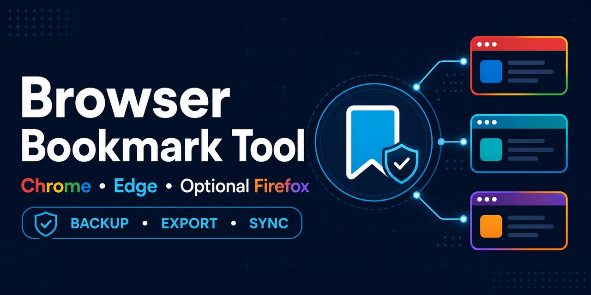

# Browser Bookmark Tool



[](https://github.com/mickpletcher/browser-bookmark-tool/actions/workflows/ci.yml)
[](LICENSE)

Browser Bookmark Tool is a Windows desktop and command-line application for backing up, exporting, and synchronizing bookmarks between Google Chrome and Microsoft Edge, with optional Firefox import and export.

The synchronization uses a conservative union. A bookmark found in either browser is retained. Deletions are not propagated.

## Project status

Version: 0.3.0

Release readiness: Source ready; trusted signing credential required for binary release

The GUI, CLI, standalone build, automated tests, transactional writes, machine-readable dry-run reporting, read-only preview-report and backup-set comparison, count-only policy gates, non-destructive backup verification, restore workflow, multi-profile mappings, backup integrity manifests, privacy-safe logging, Task Scheduler generation, vendor-neutral local AI scheduling, privacy-safe health history, and optional rate-limited failure notifications are implemented for Windows. The current `main` branch passes Windows CI and CodeQL. Release automation fails closed unless a trusted provider signs and timestamps the executable, the workflow verifies the expected publisher and signature, and checksums, a CycloneDX SBOM, and GitHub provenance are published. The project is applying to the SignPath Foundation open-source program; the existing Azure-based workflow remains unchanged until SignPath approves the project and provides the required integration settings. No signing provider is currently configured, so broad binary distribution remains blocked. Native macOS Chrome and Edge compatibility and later Safari support are separate future upgrades and are not currently implemented.

- [Current assessment](assessment.md)
- [Changelog](changelog.md)
- [Future upgrades](future-upgrades.md)
- [Completed upgrades](completed-upgrades.md)
- [Scheduled AI execution](SCHEDULING.md)
- [Contributing](CONTRIBUTING.md)
- [Support](SUPPORT.md)
- [Privacy policy](PRIVACY.md)
- [Code signing policy](CODE_SIGNING_POLICY.md)

## Features

- Detects Chrome and Edge `Default` and `Profile *` profiles and reads Firefox profiles explicitly from `%APPDATA%\Mozilla\Firefox\profiles.ini`.
- Creates timestamped copies of both original `Bookmarks` JSON files.
- Exports the merged bookmark collection to portable Netscape bookmark HTML.
- Synchronizes unique bookmarks between Chrome and Edge when requested.
- Optionally imports Firefox bookmarks into the merged union without writing Firefox.
- Optionally exports missing merged bookmarks to a dedicated Firefox `Browser Bookmark Tool` folder.
- Deduplicates bookmarks using a normalized URL.
- Optionally removes duplicate URLs already present within the merged bookmark collection.
- Optionally alphabetizes folders and bookmarks recursively.
- Prepares and validates both replacement files before changing either browser.
- Restores Chrome automatically if the Edge replacement fails.
- Restores Chrome and Edge automatically if an enabled Firefox replacement fails.
- Detects `chrome.exe` and `msedge.exe` before synchronization and detects `firefox.exe` when Firefox is an enabled write target.
- Keeps raw backups and the merged HTML export when synchronization is blocked by a running browser.
- Optionally force-closes selected browser process trees before synchronization through the CLI.
- Creates a portable HTML backup during every run.
- Retains up to 50 backup sets, with 50 as the default.
- Uses microsecond timestamps so rapid runs do not overwrite previous backups.
- Generates a new unique Chromium GUID for every imported bookmark and folder.
- Validates that the merged bookmark collection contains no duplicate GUID values.
- Uses conservative URL matching by default and keeps aggressive matching opt-in.
- Provides five merge strategies and a no-write dry-run report.
- Writes optional atomic JSON or CSV dry-run reports with settings, counts, and change categories while excluding bookmark details by default.
- Compares JSON and CSV preview reports by mapping without reopening browser profiles, can enforce direct thresholds or reusable private count-only policy profiles, and can atomically write machine-readable policy results.
- Verifies JSON recovery snapshots in a temporary Chromium profile without changing live browser files.
- Restores Chrome or Edge independently from raw JSON recovery snapshots.
- Saves and loads private named profile mappings and processes several mappings from the CLI.
- Creates and validates SHA-256 backup manifests.
- Catalogs generated backup sets by timestamp, flags missing or extra members, filters by completeness or validity, and compares count-only changes between verified sets without changing files.
- Writes count-only logs that exclude bookmark URLs by default.
- Generates PowerShell scripts for Windows Task Scheduler with backup-only defaults.
- Builds a standalone Windows executable with PyInstaller.
- Runs tests and produces the executable through SHA-pinned Windows GitHub Actions.
- Validates versioned Windows release packages and requires Authenticode signing, checksums, a CycloneDX SBOM, and GitHub attestations before publication.
- Embeds and validates Windows product name, version, description, and original-filename metadata in release executables.
- Provides scheduler-safe configuration, readiness checks, concurrency locking, and privacy-safe JSON results for local Codex, Claude, Copilot, or deterministic schedulers.
- Supports a Tkinter desktop interface and command-line execution.
- Includes a Windows batch launcher that installs the project in editable mode and starts the app.

## Current synchronization behavior

Chrome is used as the primary bookmark structure. Unique Edge bookmarks are copied into an `Imported from other browser` folder under Chrome's `Other bookmarks` root. The resulting merged structure is then written to both Chromium browsers.

Firefox is disabled by default. When enabled, Firefox bookmarks are read from the selected profile's `places.sqlite` database and unique items are added to the same merged union under `Imported from Firefox`. Firefox export requires a separate opt in. It preserves existing Firefox bookmarks and adds only missing merged URLs to `Other Bookmarks\Browser Bookmark Tool`; it does not delete or reorganize existing Firefox data.

Existing Chrome GUID values are preserved. Every imported Edge bookmark, imported folder, and generated import wrapper receives a new UUID. The merge stops before export or synchronization if duplicate GUID values remain. Repeated synchronization preserves the generated GUIDs and does not create another import folder when no new URLs exist.

Conservative URL comparison is the default:

- Removes surrounding whitespace.
- Lowercases only the URL scheme and host.
- Preserves path, query, and fragment case.
- Treats trailing slashes as significant.

Aggressive comparison is opt-in. It lowercases the complete URL and treats most trailing slashes as equivalent. It can collapse distinct case-sensitive resources and should be used only after reviewing a dry-run report.

If the same URL exists in both browsers with different names or folder locations, the Chrome copy is retained. The Edge duplicate is not imported.

Available merge strategies:

- `chrome-wins` keeps the Chrome hierarchy and imports unique Edge items.
- `edge-wins` keeps the Edge hierarchy and imports unique Chrome items.
- `preserve-both` keeps Chrome primary and places unique Edge content under `Edge favorites`.
- `merge-folders` recursively combines folders whose names match without case sensitivity.
- `dated-folder` places unique Edge content under a dated import folder.

Cross-browser URL matching is always applied while building the merged union. Conservative or aggressive matching applies equally to Chrome, Edge, and enabled Firefox data. The optional **Remove duplicate bookmarks** setting also removes repeated URLs already present within Chrome's retained structure. The first occurrence is kept.

The optional **Alphabetize bookmarks** setting sorts every folder recursively. Folders are placed first and sorted by name. Bookmarks follow and are sorted by their displayed name, or by URL when they have no name. Sorting ignores letter case.

This version does not propagate deletions. If a bookmark is deleted from one browser but still exists in the other, synchronization restores it. This behavior is intentional to reduce accidental data loss.

## Safety requirements

Close Chrome and Edge completely before synchronization. Also close Firefox when Firefox export is enabled. Include background browser processes. An open browser can overwrite synchronized data when it exits.

Before writing, the tool checks the Windows process list for `chrome.exe` and `msedge.exe`. It also checks `firefox.exe` only when Firefox export is enabled. A detected target browser blocks synchronization. Firefox import-only and disabled runs do not add a Firefox process requirement.

Process detection occurs after the raw backups and merged HTML export are created. A blocked synchronization therefore leaves both browser files unchanged while keeping the backup and export results. Backup-only and export-only runs do not check browser processes and remain available while either browser is open.

The tool creates raw backups before changing browser data. An enabled Firefox run adds a consistent `places.sqlite` backup to the validated manifest. Chrome and Edge replacements are written and parsed back as JSON. Firefox export is prepared from its backup in a separate SQLite database and must pass schema, bookmark-root, and SQLite integrity checks before any live replacement begins.

Chrome is replaced first. If that replacement fails, Edge remains unchanged. If the Edge replacement fails, the original Chrome file is restored automatically. When Firefox export is enabled, Firefox is replaced last. A Firefox replacement failure restores both original Chromium files. If automatic restoration fails, the rollback files are preserved and the raw timestamped backups remain available for manual recovery.

The CLI-only `--force` option bypasses browser process detection. Use it only after independently confirming that every write target is completely closed. It does not close browsers or prevent an open browser from overwriting synchronized data.

The CLI-only `--close-browsers` option takes the opposite approach. After backups and the HTML export are created, it force-terminates detected target process trees using Windows `taskkill /T /F`. It includes `firefox.exe` only when Firefox export is enabled and verifies all selected write targets stopped before writing.

Force-closing browsers can discard unsaved form entries, downloads, private-window state, and other active work. Use `--close-browsers` only when that loss is acceptable. It cannot be combined with `--force`.

Use **Back Up + Export HTML** first if you want to inspect the merged result without changing either browser.

## Requirements

- Windows 11 or another supported Windows version.
- Python 3.10 or newer from [python.org](https://www.python.org/downloads/windows/).
- The Python launcher available as `py` in PowerShell.
- Read and write access to the selected browser profiles and backup directory.

Confirm Python is available:

```powershell
py --version
```

## Downloads

Source code is available from this repository. [Download the current `main` source as a ZIP](https://github.com/mickpletcher/browser-bookmark-tool/archive/refs/heads/main.zip), or use a versioned source archive after [tags](https://github.com/mickpletcher/browser-bookmark-tool/tags) are published. Trusted Windows binaries will be published on [GitHub Releases](https://github.com/mickpletcher/browser-bookmark-tool/releases) only after the signing workflow is configured and the executable passes signature, timestamp, checksum, SBOM, and provenance validation.

There is no trusted Windows binary release yet. Do not treat temporary GitHub Actions build artifacts or locally generated `-unsigned` packages as public releases.

Free code signing provided by [SignPath.io](https://about.signpath.io/), certificate by [SignPath Foundation](https://signpath.org/). The application is pending acceptance into that program. See the [Code signing policy](CODE_SIGNING_POLICY.md) for current status, team roles, approval controls, and privacy requirements.

## Install the application

Install the project in editable mode from PowerShell:

```powershell
py -m pip install -e .
```

The installation provides the `browser-bookmark-tool` console command. Some Python installations do not add their `Scripts` directory to `PATH`. The documented `py -m browser_bookmark_sync` commands and the batch launcher work without that PATH entry.

## Uninstall the application

Remove an editable Python installation from PowerShell:

```powershell
py -m pip uninstall browser-bookmark-tool
```

A standalone executable is portable and does not register an uninstaller. Delete the downloaded `BrowserBookmarkTool-*.exe`, its extracted release folder, and any shortcut you created.

Uninstalling does not delete browser bookmarks, user-selected backups, exports, mappings, automation configuration, logs, results, or health history. Delete those files separately only after confirming they are no longer needed. If you registered a generated Windows scheduled task, remove that task separately by its reviewed task name:

```powershell
Unregister-ScheduledTask -TaskName "Browser Bookmark Backup" -Confirm
```

## Verify a Windows release

Do not run a downloaded executable unless all three checks pass.

Verify the Authenticode signature:

```powershell
$signature = Get-AuthenticodeSignature .\BrowserBookmarkTool-0.3.0.exe
$signature | Format-List Status, StatusMessage, SignerCertificate, TimeStamperCertificate
if ($signature.Status -ne 'Valid') { throw 'Authenticode signature validation failed.' }
```

Verify the published SHA-256 checksum:

```powershell
$fileName = 'BrowserBookmarkTool-0.3.0.exe'
$expected = ((Select-String -Path .\SHA256SUMS -Pattern "  $([regex]::Escape($fileName))$").Line -split '  ')[0]
$actual = (Get-FileHash -Algorithm SHA256 -Path ".\$fileName").Hash.ToLowerInvariant()
if ($actual -ne $expected) { throw 'SHA-256 checksum validation failed.' }
```

Verify GitHub build provenance with GitHub CLI:

```powershell
gh attestation verify .\BrowserBookmarkTool-0.3.0.exe `
    --repo mickpletcher/browser-bookmark-tool `
    --signer-workflow mickpletcher/browser-bookmark-tool/.github/workflows/release.yml
```

Each release also includes the versioned ZIP, `SHA256SUMS`, and a CycloneDX JSON SBOM. The release workflow publishes the files only after signature and checksum verification succeeds.

## Code signing policy

The complete [Code signing policy](CODE_SIGNING_POLICY.md) identifies the public source repository, maintainer roles, signing approver, manual approval requirement, executable metadata restrictions, verification controls, and response process. This is a solo-maintained project, and that policy explicitly discloses that an independent second reviewer is not currently available.

Every signing request must be manually approved after its source, tag, required checks, Windows metadata, Authenticode signature, timestamp, checksums, SBOM, and provenance are verified. No executable may be described as SignPath-signed before the SignPath Foundation application is approved and the integration is verified.

## Run the desktop app

1. Close Chrome and Edge if you intend to synchronize. Close Firefox too when **Write to Firefox** is selected.
2. Start the application using either method:

   Double-click:

   ```text
   Run Browser Bookmark Tool.bat
   ```

   Or open PowerShell in the project directory and run:

   ```powershell
   py .\browser_bookmark_sync.py --gui
   ```

3. Select the Chrome profile.
4. Select the Edge profile.
5. Leave **Include Firefox** cleared for the existing Chrome and Edge workflow. To import Firefox, select the discovered Firefox profile and enable **Include Firefox**. Select **Write to Firefox** only when Firefox should also receive missing merged bookmarks during synchronization.
6. Confirm or change the backup folder.
7. Set the number of backup sets to retain, from 1 through 50. The default is 50.
8. Select either optional organization setting when required:

   - **Remove duplicate bookmarks** removes repeated normalized URLs from the merged output.
   - **Alphabetize bookmarks** sorts folders first and bookmarks second at every folder level.

9. Select conservative or aggressive duplicate matching and the required merge strategy.
10. Choose one of the following actions:

   - **Preview Changes** displays counts, direction differences, duplicate removals, folder additions, reorder counts, and final totals without creating or changing files.
   - **Back Up + Export HTML** creates raw browser backups and a merged HTML export without changing either browser.
   - **Back Up + Sync** creates backups and the HTML export, writes the merged bookmarks to Chrome and Edge, and writes missing URLs to Firefox only when **Write to Firefox** is selected.
    - **Open Backup Folder** opens the configured backup directory.
    - **Verify Backup** checks Chromium structure, GUID uniqueness, and the matching SHA-256 manifest without changing either browser.
    - **Restore Chrome** or **Restore Edge** restores that browser independently from a selected raw JSON recovery snapshot after preserving its current file.
   - **Save Profile Mapping** and **Load Profile Mapping** manage named browser-profile pairs in a private JSON file.

The app automatically selects the first detected profile for each browser. Review both selections before running an action.

The organization settings affect the merged HTML export on both actions. They change Chrome and Edge only when **Back Up + Sync** is selected. Firefox changes require both **Include Firefox** and **Write to Firefox**.

HTML backups are portable imports but cannot directly restore full Chromium metadata. Use the JSON recovery snapshots for direct restore.

## Profile locations

The tool searches these standard locations:

```text
Chrome: %LOCALAPPDATA%\Google\Chrome\User Data\Default
Edge:   %LOCALAPPDATA%\Microsoft\Edge\User Data\Default
Firefox profile list: %APPDATA%\Mozilla\Firefox\profiles.ini
Firefox data:         <selected profile>\places.sqlite
```

It also detects directories named `Profile *` under each Chromium browser's `User Data` directory when they contain a `Bookmarks` file. Firefox discovery parses `profiles.ini`, honors `IsRelative`, prefers sections marked `Default=1`, and includes only profiles containing `places.sqlite`.

## Command-line use

### Back up and export without synchronization

Omit `--sync` to leave both browser files unchanged:

```powershell
py .\browser_bookmark_sync.py `
  --chrome-profile "$env:LOCALAPPDATA\Google\Chrome\User Data\Default" `
  --edge-profile "$env:LOCALAPPDATA\Microsoft\Edge\User Data\Default" `
  --backup-dir "$env:USERPROFILE\Documents\Browser Bookmark Backups" `
  --keep 50
```

### Back up, export, and synchronize

Close Chrome and Edge, then add `--sync`:

```powershell
py .\browser_bookmark_sync.py `
  --sync `
  --chrome-profile "$env:LOCALAPPDATA\Google\Chrome\User Data\Default" `
  --edge-profile "$env:LOCALAPPDATA\Microsoft\Edge\User Data\Default" `
  --backup-dir "$env:USERPROFILE\Documents\Browser Bookmark Backups" `
  --keep 50
```

### Remove duplicates and alphabetize

Add either option independently or use both together:

```powershell
py .\browser_bookmark_sync.py `
  --sync `
  --deduplicate `
  --alphabetize `
  --chrome-profile "$env:LOCALAPPDATA\Google\Chrome\User Data\Default" `
  --edge-profile "$env:LOCALAPPDATA\Microsoft\Edge\User Data\Default" `
  --backup-dir "$env:USERPROFILE\Documents\Browser Bookmark Backups"
```

Omit `--sync` to apply the selected organization options only to the HTML export. The raw Chrome and Edge files remain unchanged.

### Preview changes

Dry-run mode reads both profiles and reports the planned changes. It does not create backups, exports, manifests, logs, or browser writes.

```powershell
py .\browser_bookmark_sync.py `
  --dry-run `
  --deduplicate `
  --alphabetize `
  --duplicate-mode conservative `
  --merge-strategy merge-folders `
  --chrome-profile "$env:LOCALAPPDATA\Google\Chrome\User Data\Default" `
  --edge-profile "$env:LOCALAPPDATA\Microsoft\Edge\User Data\Default"
```

Run this before aggressive duplicate matching, a new merge strategy, or a first synchronization.

Save the same preview as a privacy-safe JSON or CSV report:

```powershell
py .\browser_bookmark_sync.py `
  --dry-run `
  --preview-report "D:\Private\browser-bookmark-preview.json" `
  --chrome-profile "$env:LOCALAPPDATA\Google\Chrome\User Data\Default" `
  --edge-profile "$env:LOCALAPPDATA\Microsoft\Edge\User Data\Default"
```

The extension selects the format. JSON uses a versioned `preview-report` document with one entry per selected mapping. CSV uses `mapping`, `category`, `metric`, and `value` rows. Default reports contain merge settings, browser and final counts, URL change categories, duplicate counts, and folder changes. They exclude browser-profile paths, bookmark names, URLs, and folder paths.

Add `--include-bookmark-details` only when the private report must include merged bookmark names, URLs, and folder paths. Detailed reports can expose browsing history, internal sites, tokens embedded in URLs, and account information. Store every preview report outside the repository. Standard `browser-bookmark-preview*.json` and `.csv` names are ignored as a secondary safeguard.

Report generation reads the selected profiles and atomically creates or replaces only the requested report. It rejects destinations inside selected browser profiles and does not create backups, HTML exports, manifests, logs, or scheduler results. It never synchronizes browser files or invokes backup pruning. If any selected mapping fails, no report is written.

Compare two version 1 reports without reopening browser profiles:

```powershell
py -m browser_bookmark_sync `
  --compare-preview-reports `
  "D:\Private\browser-bookmark-preview-before.json" `
  "D:\Private\browser-bookmark-preview-after.csv"
```

JSON and CSV can be compared directly. Mappings are matched by name. Output lists settings, browser counts, planned URL additions, duplicate counts, and folder-change differences. It also reports mappings found in only one input. The comparison reads only the two reports and never changes them, opens browser profiles, or creates backups.

Add optional count-only gates for local automation or CI:

```powershell
py -m browser_bookmark_sync `
  --compare-preview-reports `
  "D:\Private\browser-bookmark-preview-before.json" `
  "D:\Private\browser-bookmark-preview-after.json" `
  --max-planned-additions 25 `
  --max-duplicate-removals 10 `
  --max-folder-changes 5
```

The policy counts come from the newer report and are aggregated across its mappings. Exit code `0` means the comparison and configured gates passed. Exit code `1` means an input, schema, or option was invalid. Exit code `2` means at least one threshold was exceeded.

Detailed reports are rejected by default. Add `--acknowledge-private-preview-details` only after confirming both inputs may be processed locally. The comparison still prints count-only output and never prints bookmark names, URLs, or folder paths.

For repeatable gates, copy [preview-policy.example.json](preview-policy.example.json) outside the repository. Replace `baseline_sha256` with the SHA-256 of the exact older report and list every expected mapping. The policy contains no report paths:

```powershell
$baseline = "D:\Private\browser-bookmark-preview-baseline.json"
$policy = "D:\Private\preview-policy.json"
$hash = (Get-FileHash -LiteralPath $baseline -Algorithm SHA256).Hash.ToLowerInvariant()
```

Set the calculated `$hash` as `baseline_sha256`, review the aggregate limits, and add only the per-mapping overrides that need stricter limits. Then run:

```powershell
py -m browser_bookmark_sync `
  --compare-preview-reports `
  $baseline `
  "D:\Private\browser-bookmark-preview-current.json" `
  --preview-policy $policy `
  --preview-result "D:\Private\preview-result.json"
```

The version 1 policy fails closed when the baseline hash differs, either report is missing an expected mapping, either report contains an unexpected mapping, or the policy schema is invalid. Aggregate limits apply to the entire newer report. A mapping entry inherits omitted aggregate values and overrides the limits it specifies. Direct threshold options cannot be combined with `--preview-policy`.

`--preview-result` atomically creates or replaces a version 1 `preview-policy-result` JSON document after a valid comparison, including when a policy gate returns exit code `2`. It records the two input SHA-256 hashes, the policy hash when used, expected mapping names, aggregate and per-mapping counts, configured limits, violations, status, and exit code. It never stores report paths, policy paths, browser-profile paths, bookmark names, URLs, or folder paths. The destination must end in `.json` and cannot replace either input report or the selected policy. Store results outside the repository. Standard `preview-result*.json` names are ignored as a secondary safeguard.

### Include Firefox

Firefox stays disabled unless an explicit profile is supplied. This command imports Firefox into the merged union and writes Chrome and Edge only:

```powershell
py -m browser_bookmark_sync `
  --sync `
  --chrome-profile "$env:LOCALAPPDATA\Google\Chrome\User Data\Default" `
  --edge-profile "$env:LOCALAPPDATA\Microsoft\Edge\User Data\Default" `
  --firefox-profile "$env:APPDATA\Mozilla\Firefox\Profiles\PROFILE.default-release" `
  --backup-dir "D:\Browser Bookmark Backups"
```

Add `--firefox-export` to write missing merged URLs to Firefox too. Firefox export requires `--sync`, creates and manifests `Firefox_*.sqlite` before checkpointing or replacing Firefox data, and blocks if `firefox.exe` is running unless `--force` or `--close-browsers` is explicitly selected.

Named mappings store an optional `firefox_profile`. Add `--enable-firefox` to use those paths. The path remains ignored when the flag is omitted, so existing Chrome and Edge mapping behavior does not change. Add `--firefox-export` with `--sync` only when the named Firefox profiles should be write targets.

### Named profile mappings

Copy [profile-mappings.example.json](profile-mappings.example.json) outside the repository and replace the placeholder paths. Mapping files contain private local paths and are ignored by Git.

Run one mapping:

```powershell
py .\browser_bookmark_sync.py `
  --dry-run `
  --profile-map "D:\Private\profile-mappings.json" `
  --mapping Personal
```

Repeat `--mapping` to run several named mappings. Omit `--mapping` to process every mapping in the file. Each mapping has its own Chrome profile, Edge profile, optional Firefox profile, and backup directory, which reduces the risk of mixing work and personal profiles.

### Verify a JSON recovery snapshot

Verify a generated snapshot before attempting a restore:

```powershell
py .\browser_bookmark_sync.py `
  --verify-backup "D:\Browser Bookmark Backups\Chrome_2026-08-08_12-00-00_000001.json"
```

The tool copies the snapshot into an isolated temporary Chromium profile, validates its root and node structure, rejects malformed or duplicate GUIDs, and verifies every file in the matching `Manifest_*` file. It reports bookmark and folder counts, removes the temporary profile, and never reads or writes a live browser profile. Use `--verify-manifest` only when supplying the matching manifest path explicitly.

### Catalog and compare backup sets

Inventory generated backups without supplying browser profiles:

```powershell
py .\browser_bookmark_sync.py `
  --catalog-backups `
  --catalog-filter all `
  --backup-dir "D:\Browser Bookmark Backups"
```

The `all`, `complete`, `incomplete`, `valid`, and `invalid` filters are available in both the GUI and CLI. Completeness reports missing or extra generated set members. Validity covers manifest integrity and readable Chrome, Edge, or Firefox recovery content. Each complete, valid set shows bookmark and folder changes from the previous complete, valid set. Bookmark names and URLs are never displayed.

Compare two complete, valid sets directly by generated timestamp:

```powershell
py .\browser_bookmark_sync.py `
  --compare-backups 2026-08-08_12-00-00_000001 2026-08-08_13-00-00_000001 `
  --backup-dir "D:\Browser Bookmark Backups"
```

Catalog and comparison operations read only the selected backup directory. Firefox SQLite inspection uses immutable mode so it does not create WAL or shared-memory sidecars. These operations do not open live browser profiles or create, rename, replace, prune, or delete backup files.

### Restore a JSON recovery snapshot

Close the target browser, then restore it independently:

```powershell
py .\browser_bookmark_sync.py `
  --restore-backup "D:\Browser Bookmark Backups\Chrome_2026-08-07_12-00-00_000001.json" `
  --restore-browser Chrome `
  --chrome-profile "$env:LOCALAPPDATA\Google\Chrome\User Data\Default" `
  --edge-profile "$env:LOCALAPPDATA\Microsoft\Edge\User Data\Default" `
  --backup-dir "D:\Browser Bookmark Backups"
```

The current `Bookmarks` file is copied to a `Chrome_PreRestore_*` or `Edge_PreRestore_*` recovery file first. HTML backups must be imported through the browser.

### Generate a Task Scheduler script

This writes a PowerShell registration script without registering a task automatically. Generated tasks are backup-only unless `--task-sync` is explicitly supplied.

```powershell
py .\browser_bookmark_sync.py `
  --write-task-script "D:\Private\register-bookmark-task.ps1" `
  --task-name "Browser Bookmark Backup" `
  --task-time "02:00" `
  --chrome-profile "$env:LOCALAPPDATA\Google\Chrome\User Data\Default" `
  --edge-profile "$env:LOCALAPPDATA\Microsoft\Edge\User Data\Default" `
  --backup-dir "D:\Browser Bookmark Backups"
```

Review the generated script before running it. Add `--task-sync` only when unattended synchronization is intended and browser-process behavior has been tested.

### Schedule through Codex, Claude, or Copilot

AI schedulers use the same local PowerShell entrypoint and private JSON configuration. The scheduling model does not directly parse or modify bookmark files.

Copy `automation-config.example.json` outside the repository, update its private paths, and validate it:

```powershell
.\Invoke-BrowserBookmarkAutomation.ps1 `
  -ConfigPath "D:\Private\browser-bookmark-automation.json" `
  -Mode Check
```

Run the reviewed configuration manually before creating a recurring schedule:

```powershell
.\Invoke-BrowserBookmarkAutomation.ps1 `
  -ConfigPath "D:\Private\browser-bookmark-automation.json" `
  -Mode Run
```

The default example is backup-only. Scheduled synchronization requires `operation` set to `sync`. Running browsers either block synchronization after backups and HTML export or are force-closed only when `browser_behavior` is explicitly set to `close`. Scheduled execution has no `--force` equivalent.

Every scheduled run appends an allowlisted record to the capped private `health_file`. Records contain only operation status, mapping names, numeric counts, duration, Chrome or Edge process names, and an error category. Optional failure notification delivery is disabled by default. When enabled, the configured local command receives only that sanitized record through standard input. Consecutive matching failures notify once until a successful run or a different failure resets suppression.

See [SCHEDULING.md](SCHEDULING.md) for the full private configuration schema, structured result format, concurrency behavior, security boundary, and copy-ready Codex, Claude, and Copilot prompts.

### Logging

Every backup or synchronization writes a count-only `browser-bookmark-tool.log` in the backup directory. It records timestamps, actions, counts, strategy, and process names. It does not record bookmark names or URLs. Use `--log-file` to select another private path and `--verbose` for additional count-only reporting.

### Force synchronization

Process detection is a write-safety control. If detection itself is unavailable and you have independently confirmed that every write target is closed, advanced users can bypass it:

```powershell
py .\browser_bookmark_sync.py `
  --sync `
  --force `
  --chrome-profile "$env:LOCALAPPDATA\Google\Chrome\User Data\Default" `
  --edge-profile "$env:LOCALAPPDATA\Microsoft\Edge\User Data\Default"
```

Do not use `--force` merely because synchronization reported a browser executable. Close the detected processes first.

### Close browsers automatically

Use the explicit close parameter when forced process termination is acceptable:

```powershell
py .\browser_bookmark_sync.py `
  --sync `
  --close-browsers `
  --chrome-profile "$env:LOCALAPPDATA\Google\Chrome\User Data\Default" `
  --edge-profile "$env:LOCALAPPDATA\Microsoft\Edge\User Data\Default" `
  --backup-dir "$env:USERPROFILE\Documents\Browser Bookmark Backups" `
  --keep 50
```

Backups and the HTML export are created before process termination. The command returns an error without writing either browser if Chrome or Edge remains running after the close attempt.

### Command-line options

| Option | Required | Description |
| --- | --- | --- |
| `--gui` | No | Opens the desktop interface. |
| `--sync` | No | Writes the merged bookmarks to Chrome and Edge. Without it, the run only backs up and exports. |
| `--dry-run` | No | Reports planned counts and folder changes without changing browser or backup files. |
| `--preview-report` | Dry run report | Writes all selected mapping previews to a `.json` or `.csv` file; requires `--dry-run`. |
| `--include-bookmark-details` | No | Explicitly includes private bookmark names, URLs, and folder paths in `--preview-report`. |
| `--compare-preview-reports` | Preview comparison | Older and newer version 1 JSON or CSV reports to compare by mapping. |
| `--acknowledge-private-preview-details` | No | Allows local comparison of detailed reports while keeping output count-only. |
| `--preview-policy` | No | Private versioned JSON policy containing the baseline hash, expected mappings, aggregate limits, and optional per-mapping overrides. |
| `--preview-result` | Preview comparison | Atomically writes a versioned count-only JSON result for a preview comparison, including policy failures. |
| `--max-planned-additions` | No | Returns exit code `2` when newer URL additions exceed this aggregate count. |
| `--max-duplicate-removals` | No | Returns exit code `2` when newer duplicate removals exceed this aggregate count. |
| `--max-folder-changes` | No | Returns exit code `2` when newer folder additions and reorders exceed this aggregate count. |
| `--check-automation` | AI or local scheduling | Validates a private automation configuration without creating backups or changing browser files. |
| `--run-automation` | AI or local scheduling | Executes a private automation configuration under a concurrency lock and writes a privacy-safe JSON result. |
| `--verify-backup` | Backup verification | Raw JSON recovery snapshot to validate without changing browser files. |
| `--verify-manifest` | No | Explicit matching manifest path for `--verify-backup`. |
| `--catalog-backups` | Backup catalog | Groups generated backup files by timestamp and reports count-only status and changes. |
| `--catalog-filter` | No | Filters the catalog by `all`, `complete`, `incomplete`, `valid`, or `invalid`. |
| `--compare-backups` | Backup comparison | Two generated timestamps identifying complete, valid sets to compare. |
| `--chrome-profile` | CLI operations | Path to a Chrome profile containing `Bookmarks`. |
| `--edge-profile` | CLI operations | Path to an Edge profile containing `Bookmarks`. |
| `--firefox-profile` | No | Explicit Firefox profile containing `places.sqlite`; enables Firefox for a direct run. |
| `--enable-firefox` | No | Uses optional `firefox_profile` paths from named mappings. |
| `--firefox-export` | No | Adds Firefox as a write target during `--sync`; requires Firefox to be enabled. |
| `--backup-dir` | No | Output directory. Defaults to `Documents\Browser Bookmark Backups`. |
| `--profile-map` | No | Private JSON file containing named profile mappings. |
| `--mapping` | No | Mapping name to process. Repeat for several mappings. |
| `--keep` | No | Number of backup sets to retain. Accepts `1` through `50` and defaults to `50`. |
| `--deduplicate` | No | Removes repeated normalized URLs from the merged collection. |
| `--alphabetize` | No | Sorts folders first and bookmarks second, recursively and without case sensitivity. |
| `--duplicate-mode` | No | `conservative` by default or explicit `aggressive` matching. |
| `--merge-strategy` | No | Selects `chrome-wins`, `edge-wins`, `preserve-both`, `merge-folders`, or `dated-folder`. |
| `--force` | No | Bypasses browser process detection during synchronization. It has no effect on export-only runs. |
| `--close-browsers` | No | Force-terminates detected write-target browser process trees, verifies closure, then synchronizes. Cannot be combined with `--force`. |
| `--restore-backup` | Restore | Raw JSON recovery snapshot to restore. |
| `--restore-browser` | Restore | Target browser: `Chrome` or `Edge`. |
| `--log-file` | No | Overrides the private count-only log path. |
| `--verbose` | No | Prints and logs additional count-only details. |
| `--write-task-script` | Task generation | Destination PowerShell script. |
| `--task-name` | No | Scheduled task name. |
| `--task-time` | No | Daily task time in 24-hour `HH:MM` format. |
| `--task-sync` | No | Explicitly makes a generated task synchronize instead of backup only. |

If no CLI operation is supplied, the application opens the GUI. Direct CLI operations require both profile arguments unless a profile map supplies them.

## Backup files

Each run creates one portable HTML backup, two raw JSON recovery snapshots, a SHA-256 manifest, and a privacy-safe log in the backup directory. An enabled Firefox run also creates a consistent SQLite recovery snapshot:

```text
Chrome_YYYY-MM-DD_HH-MM-SS_microseconds.json
Edge_YYYY-MM-DD_HH-MM-SS_microseconds.json
Firefox_YYYY-MM-DD_HH-MM-SS_microseconds.sqlite  # only when Firefox is enabled
Bookmarks_YYYY-MM-DD_HH-MM-SS_microseconds.html
Manifest_YYYY-MM-DD_HH-MM-SS_microseconds.json
browser-bookmark-tool.log
```

The HTML file is the portable bookmark backup. It contains the merged collection and can be imported into browsers that support Netscape bookmark HTML. Chrome and Edge JSON files retain Chromium recovery metadata. `Firefox_*.sqlite` is a complete SQLite backup created through SQLite's backup API, including committed WAL data. The manifest records file names, sizes, SHA-256 hashes, and count-only operation data. The tool validates the manifest before retention pruning, can catalog and compare complete backup sets without changing them, and can independently verify a selected Chromium recovery snapshot against its matching manifest before restore.

Retention is applied separately to Chrome JSON recovery snapshots, Edge JSON recovery snapshots, Firefox SQLite recovery snapshots, merged HTML backups, and manifests. The tool accepts 1 through 50 backup sets and defaults to 50. Microsecond timestamps prevent repeated runs during the same second from overwriting earlier files. The append-only operation log and pre-restore recovery files are not pruned automatically.

Retention is ordered by the timestamp in each generated filename. It does not rely on file modification times, which raw browser copies can inherit from the source file. Pruning only removes regular files that match the tool's generated Chrome JSON, Edge JSON, Firefox SQLite, Bookmarks HTML, or Manifest JSON naming format.

## Privacy and security

Bookmark files, Firefox `places.sqlite` databases, backups, preview reports, preview policies, preview results, profile mappings, automation configurations, and private scheduler outputs can expose browsing history, internal URLs, access tokens embedded in URLs, usernames, mapping names, and private filesystem paths. Store them outside the repository and do not attach real data to issues, prompts, pull requests, or cloud artifacts. Detailed preview comparison requires an explicit acknowledgment and still emits count-only output. Machine-readable preview results exclude bookmark details and local paths but contain mapping names, hashes, limits, and operational counts. The project `.gitignore` blocks browser bookmark files, generated backups, standard preview report, private policy, and preview result names, logs, restore snapshots, task scripts, private profile mappings, automation results, health histories, and lock files as a secondary safeguard. Only sanitized examples belong in Git. Notification commands must obtain credentials from a private local mechanism instead of command arguments.

Report security vulnerabilities privately through GitHub. See the [security policy](SECURITY.md) for the reporting process and evidence requirements.

The application has no telemetry, analytics, advertising, automatic update checks, cloud synchronization, or built-in bookmark upload. See [PRIVACY.md](PRIVACY.md) for local data handling, optional user-configured notification delivery, retention, and deletion details.

The GitHub repository keeps Issues enabled and disables unused Projects, Wiki, Discussions, and Pages features. Pull requests use squash merge only and merged branches are deleted automatically. The protected `main` branch blocks force pushes and deletion, enforces linear history and resolved review conversations, requires a current pull request and all five Windows CI checks, and permits administrator emergency bypass. GitHub Actions has read-only default permissions, requires full commit SHA pinning, and permits GitHub-owned actions plus the exact reviewed Azure actions used by the current fail-closed release workflow. Secret scanning, push protection, Dependabot alerts and security updates, weekly Dependabot version updates, private vulnerability reporting, and CodeQL default setup are enabled. Non-provider secret patterns and secret validity checks are unavailable for this account and remain disabled.

## Restore a backup

1. Close Chrome and Edge completely.
2. Open `Documents\Browser Bookmark Backups`, or the custom backup directory used for the run.
3. Choose the required `Chrome_*.json` or `Edge_*.json` backup.
4. Make a copy of that backup.
5. Rename the copy to `Bookmarks` with no file extension.
6. Go to the matching browser profile directory.
7. Preserve the current `Bookmarks` file under a different name.
8. Place the restored `Bookmarks` file in the profile directory.
9. Start the browser and verify the restored bookmarks before deleting the preserved file.

Do not restore a Chrome backup into Edge or an Edge backup into Chrome unless you have independently verified the file contents and accept the risk.

## Known limitations

- The tool closes browsers only when the CLI `--close-browsers` option is explicitly used.
- Automatic closure uses forceful process-tree termination and is available only through the explicit `--close-browsers` CLI option.
- Chromium auto-detection is limited to standard `Default` and `Profile *` directory names. Firefox uses explicit `profiles.ini` entries.
- Firefox export supports current Places schemas that contain the required bookmark, URL hash, GUID, timestamp, and Sync metadata columns. An unsupported schema fails before live replacement.
- Firefox export adds missing URLs to a tool-owned folder. It does not mirror Chromium folder layout, propagate deletions, or provide direct Firefox restore. Preserve `Firefox_*.sqlite` for manual recovery while Firefox is closed.
- Deletions are intentionally not synchronized.
- Duplicate removal and alphabetization are disabled by default.
- Direct restore requires JSON recovery snapshots. HTML restore uses the browser's import function.
- Preview reports are CLI-only. Detailed reports are private data and must not be committed or attached to public issues.
- Task Scheduler support generates a reviewed PowerShell registration script. It does not silently register tasks.
- Cloud-hosted AI agents cannot access browser profiles on the local Windows computer. Scheduled browser operations require a local scheduler or a tightly controlled self-hosted Windows runner using the same Windows account.
- The standalone executable is Windows-only and is built as a console-capable application so CLI output remains available.
- No public executable release exists until a trusted Authenticode certificate is configured. Build from source until the signed release workflow succeeds.

Track fixes and release-readiness changes in the [assessment](assessment.md) and [changelog](changelog.md).

## Development

Run the test suite:

```powershell
py -m pip install -e ".[dev]"
py -m pytest -q
py -m ruff check .
```

Run a syntax check:

```powershell
py -m py_compile browser_bookmark_sync.py test_sync.py
```

Current verification results are recorded in [assessment.md](assessment.md).

Build the standalone executable:

```powershell
.\build.ps1
```

The executable is written to `dist\BrowserBookmarkTool.exe`. The SHA-pinned Windows workflow in [.github/workflows/ci.yml](.github/workflows/ci.yml) tests Python 3.10 through 3.13, runs lint, compilation, CLI, and dependency checks, builds the executable after the test matrix passes, and retains the workflow artifact for 14 days. Current live workflow status and any release blockers are recorded in [assessment.md](assessment.md).

Validate the release packaging locally without creating a distributable signed package:

```powershell
.\build-release.ps1 -Version 0.3.0 -OutputDirectory .\release -Mode Unsigned
```

The script creates an isolated temporary Python environment for PyInstaller and CycloneDX. This prevents unrelated global packages and local editable-install paths from entering the SBOM. `-Mode Unsigned` adds `-unsigned` to executable and ZIP names. It is for packaging validation only. The tag-triggered [.github/workflows/release.yml](.github/workflows/release.yml) uses separate prepare and finalize phases around Azure signing.

The `release` GitHub environment accepts only `v*` tags. Configure these values in that environment before creating `v0.3.0`:

- Secrets `AZURE_CLIENT_ID`, `AZURE_TENANT_ID`, and `AZURE_SUBSCRIPTION_ID`: the OIDC-enabled Azure app registration values.
- Variable `AZURE_ARTIFACT_SIGNING_ENDPOINT`: the regional Artifact Signing endpoint.
- Variable `AZURE_ARTIFACT_SIGNING_ACCOUNT`: the Artifact Signing account name.
- Variable `AZURE_ARTIFACT_SIGNING_PROFILE`: the public-trust certificate profile name.
- Variable `WINDOWS_SIGNING_SUBJECT`: the exact expected Authenticode signer subject.

Configure the Azure federated credential for the `repo:mickpletcher/browser-bookmark-tool:environment:release` subject and grant the identity the Artifact Signing Certificate Profile Signer role on the certificate profile. [Publicly trusted code-signing keys must remain hardware protected](https://cabforum.org/working-groups/code-signing/requirements/), so the workflow uses OIDC and [Azure Artifact Signing](https://learn.microsoft.com/en-us/azure/artifact-signing/how-to-signing-integrations) instead of storing an exportable private key in GitHub.

The workflow requires the tag version to match `pyproject.toml` and the tagged commit to be on `main`. It builds the unsigned executable and SBOM, signs with SHA-256 and an RFC 3161 timestamp, verifies `Valid` status, the code-signing EKU, the expected publisher subject, and the timestamp, generates and verifies `SHA256SUMS`, publishes provenance and SBOM attestations, and then creates the GitHub Release. Missing or invalid Azure configuration stops the job before publication.

The repository Actions allowlist still requires full commit SHA pinning. It permits GitHub-owned actions plus only the exact reviewed Azure Login 3.0.1 and Azure Artifact Signing 2.0.0 commits used by the release workflow.

The project is applying for SignPath Foundation service as a no-cost alternative. Do not add SignPath credentials, actions, or signing steps until the application is approved and SignPath supplies the project configuration. If accepted, replace the Azure-specific signing step in a reviewed pull request while preserving tag validation, manual signing approval, version-metadata enforcement, signature and timestamp checks, checksums, SBOM generation, provenance, and fail-closed publication. Update the repository Actions allowlist only for exact reviewed and full-SHA-pinned dependencies required by that integration.

The current test suite contains 104 passing cases covering conservative and aggressive cross-browser URL matching, explicit Firefox profile discovery, Firefox Places import and export, Firefox backup ordering and manifests, three-browser rollback, disabled-mode isolation, five merge strategies, privacy-safe JSON and CSV dry-run reports, named multi-profile execution, read-only backup catalog and comparison, non-destructive backup verification, restore safety, Chromium schema checks, duplicate GUID rejection, SHA-256 manifests, manifest mismatch and path validation, privacy-safe logging, Task Scheduler generation, scheduler configuration, readiness, locking, structured results, health history, notification controls, organization, retention, transaction and process controls, CLI behavior, and GUI errors.

## Contributing and support

Use [CONTRIBUTING.md](CONTRIBUTING.md) for the development workflow, branch and tag conventions, test requirements, pull request rules, and signing roles. Use [SUPPORT.md](SUPPORT.md) for usage help. Participation is governed by [CODE_OF_CONDUCT.md](CODE_OF_CONDUCT.md). Report vulnerabilities privately through [SECURITY.md](SECURITY.md). Data handling is documented in [PRIVACY.md](PRIVACY.md), and release-signing controls are documented in [CODE_SIGNING_POLICY.md](CODE_SIGNING_POLICY.md).

## Documentation maintenance requirement

Every project change must include a review and update of:

- [README.md](README.md) for installation, operation, behavior, limitations, or development guidance affected by the change.
- [assessment.md](assessment.md) for current status, open findings, release readiness, and verification results.
- [changelog.md](changelog.md) for a concise entry under `[Unreleased]`.
- [future-upgrades.md](future-upgrades.md) when priorities, dependencies, or candidate upgrades change.
- [completed-upgrades.md](completed-upgrades.md) when a tracked upgrade is implemented and verified.
- [SCHEDULING.md](SCHEDULING.md) when scheduler configuration, prompts, security boundaries, or execution behavior changes.

This requirement applies to code, tests, documentation, configuration, packaging, and workflow changes. Do not leave instructions or status statements that describe behavior the application no longer has.

When an upgrade is completed, remove it from `future-upgrades.md`, add it to `completed-upgrades.md` with its completion evidence, and add at least one new candidate to the future backlog. A completed upgrade must never appear in both files.
